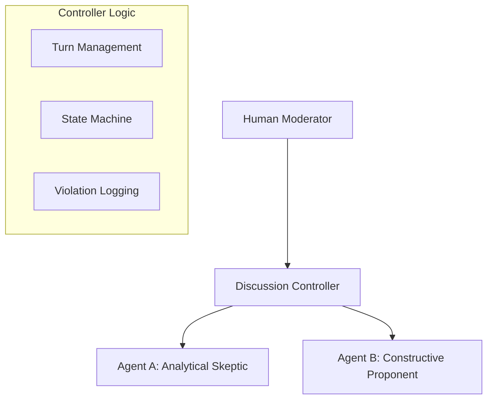

# Moderated Multi-Agent Discussion System

**A framework for controlled, epistemic interaction between autonomous LLM agents and a human moderator.**


## 📖 Overview

The **Moderated Multi-Agent Discussion System** is a research-oriented tool designed to orchestrate structured debates between two autonomous AI agents (powered by Google Gemini) under the strict supervision of a human moderator. 

Unlike standard "agent swarms" or free-running conversation loops, this system enforces **explicit turn-taking**, **role adherence**, and **epistemic rigor**. It treats moderation not as an afterthought, but as a first-class component of the system architecture.

### Research Goals
This project serves as a testbed for investigating:
*   **Multi-agent orchestration**: managing state and turn logic explicitly.
*   **Role conditioning**: ensuring agents maintain distinct epistemic stances (e.g., Skeptic vs. Proponent) over long contexts.
*   **Human-in-the-loop control**: studying how active moderation impacts agent hallucination, topic drift, and agreement collapse.
*   **Grounding vs. Fluency**: Distinguishing between agents that sound convincing and agents that are factually grounded.

## 🏗 Architecture

The system follows a **Triadic Architecture**:



### Key Components
1.  **Discussion Controller**: The "brain" of the system. It manages the state machine (Introduction -> Argument -> Synthesis), adheres to a rigid turn order, and injects moderator commands.
2.  **Hard-Contract Agents**: Agents are not just prompted to "be helpful"; they operate under a strict "Hard Contract" system prompt that penalizes emotional roleplay, demands conciseness, and forbids speaking out of turn.
3.  **Moderator Interface**: A CLI built with `rich` that gives the human supervisor distinct commands to control the flow.

## 🚀 Features

*   **Explicit Turn Control**: Agents never speak back-to-back unless authorized.
*   **Phase-Based Discussion**: Support for distinct phases (Introduction, Argumentation, Synthesis) that define the context of the conversation.
*   **Active Interventions**:
    *   `PAUSE`/`UNPAUSE`: remove an agent from the rotation.
    *   `REPHRASE`: Reject an agent's output and force a retry.
    *   `EVIDENCE`: Systematically demand citations for a specific claim.
    *   `INTERJECT`: Inject human context directly into the agent's working memory.

## 📦 Installation

1.  **Clone the repository**:
    ```bash
    git clone https://github.com/yourusername/moderated-discussion-system.git
    cd moderated-discussion-system
    ```

2.  **Install dependencies**:
    ```bash
    pip install -r requirements.txt
    ```

3.  **Set up API Key**:
    The system requires a Google Gemini API key.
    ```bash
    export GOOGLE_API_KEY="your_actual_api_key"
    ```

## 💻 Usage

Start the system using the helper script (handles python path issues):
```bash
./run.sh
```

### Moderator Commands
Once the discussion starts, you have full control via the CLI:

| Command | Description |
| :--- | :--- |
| `NEXT` | Trigger the next agent's turn. |
| `INTERJECT <msg>` | Speak as the moderator. Agents will see this in their context. |
| `PAUSE <agent>` | Temporarily silence an agent (e.g., `PAUSE AgentA`). |
| `UNPAUSE <agent>` | Bring an agent back into the discussion. |
| `REPHRASE` | Reject the last turn and ask the agent to try again. |
| `EVIDENCE <agent>` | Demand proofs/citations for the last claim. |
| `PHASE <phase>` | Switch context (Introduction, Argumentation, Synthesis). |
| `QUIT` | End sesson. |

## 🧪 Research & Experiments

To get the most out of this system, try these failure mode experiments:
1.  **Hallucination Check**: Force an agent to defend a subtle falsehood. Use `EVIDENCE` to see if they double down or retract.
2.  **Agreement Collapse**: If agents agree too quickly, use `INTERJECT` to play "Devil's Advocate" and force them back into debate.
3.  **Role Breaking**: Try to emotionally provoke the "Analytical Skeptic" to see if they break their "no emotion" contract.

## 🔮 Future Roadmap
*   **Automated Evaluation**: Add a third "Judge" LLM to score arguments automatically.
*   **Retrieval (RAG)**: Give agents access to a shared document corpus for grounding.
*   **Policy Engine**: Replace the human moderator with a rule-based policy for automated training.

## 📄 License
MIT License
